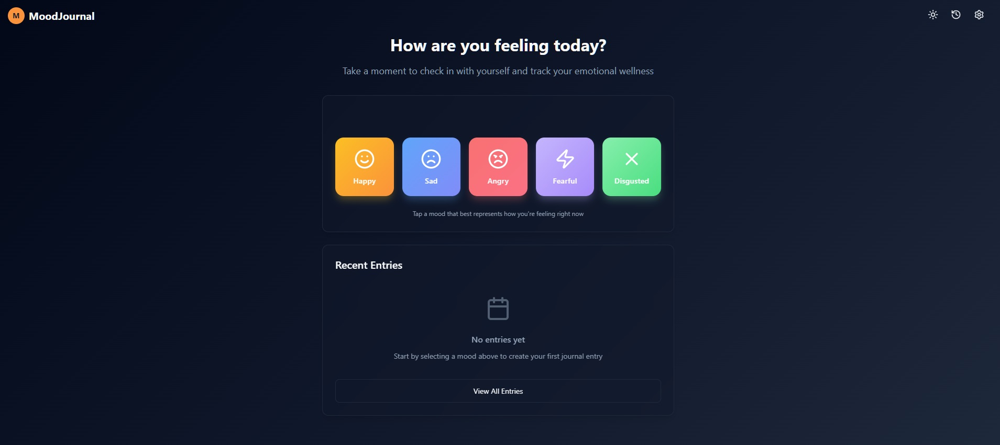
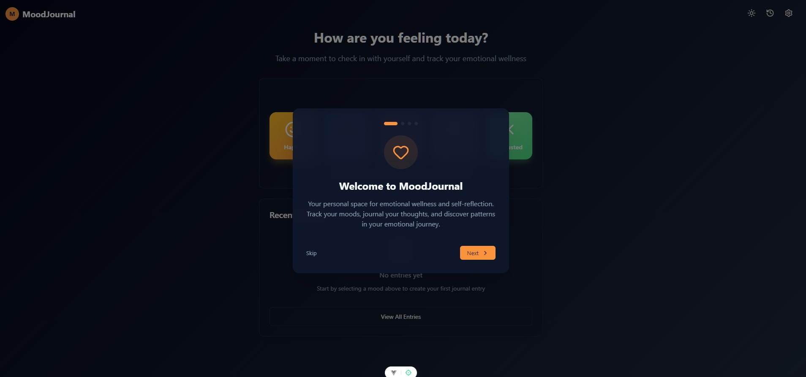
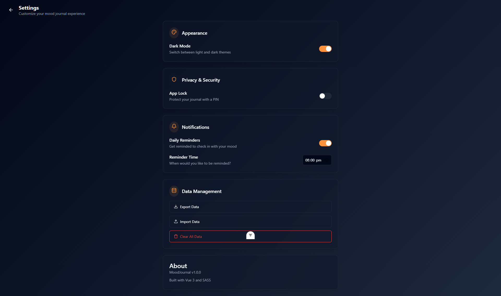

# MoodJournal 🌟

A beautiful and intuitive mood tracking and journaling application designed to support your emotional wellness journey. Track your daily moods, write reflective journal entries, and gain insights into your emotional patterns over time.

## ✨ Features

### Core Functionality

- **Mood Selection**: Track your emotions using five core moods (Happy, Sad, Anger, Fear, Disgust)
- **Journal Entries**: Write detailed reflections with mood-specific prompts and suggestions
- **Local Storage**: All data is stored locally on your device for complete privacy
- **Responsive Design**: Optimized for both desktop and mobile devices

### Advanced Features

- **Mood History & Analytics**: Visual calendar view and statistics to track emotional patterns
- **Mood Insights**: AI-powered suggestions and coping strategies based on your mood patterns
- **Theme Support**: Beautiful light and dark mode themes
- **App Security**: Optional PIN lock protection for privacy
- **Daily Reminders**: Configurable notifications to encourage regular check-ins
- **Data Management**: Export, import, and clear your journal data
- **Onboarding Flow**: Guided introduction for new users

## Screenshots

- 
- 
- 

## 🚀 Getting Started

### Prerequisites

- Node.js 18+
- npm or yarn package manager

### Installation

1. **Clone the repository** \`\`\`bash git clone https://github.com/yourusername/mood-journal.git cd mood-journal \`\`\`

2. **Install dependencies** \`\`\`bash npm install

   # or

   yarn install \`\`\`

3. **Start the development server** \`\`\`bash npm run dev

   # or

   yarn dev \`\`\`

4. **Open your browser** Navigate to [http://localhost:5173](http://localhost:5173) to see the application.

## 🛠️ Tech Stack

- **Framework**: Vue3 with Composition API and Typescript
- **Styling**: SASS
- **Icons**: Lucide React
- **Storage**: Browser localStorage for data persistence
- **Animations**: CSS animations and transitions
- **Date/Time**: Date-fns for date manipulation
- **Router**: Vue Router

## 🎨 Design System

### Color Palette

- **Primary**: Warm orange (#ea580c) - Energy and optimism
- **Secondary**: Vibrant orange (#f97316) - Warmth and encouragement
- **Mood Colors**:
  - Happy: Golden yellow (#fbbf24)
  - Sad: Calm blue (#3b82f6)
  - Anger: Bold red (#ef4444)
  - Fear: Deep purple (#8b5cf6)
  - Disgust: Fresh green (#10b981)

## 📱 Usage Guide

### Getting Started

1. **First Visit**: Complete the onboarding flow to learn about the app's features
2. **Daily Check-in**: Select your current mood from the five emotion options
3. **Journal Entry**: Write about your day, thoughts, or feelings in the guided journal
4. **Review History**: Visit the History page to see patterns and insights over time
5. **Customize Settings**: Adjust themes, notifications, and privacy settings

### Privacy & Security

- All data is stored locally on your device
- Optional PIN lock for additional security
- No data is sent to external servers
- Export your data anytime for backup

### Tips for Best Results

- Try to check in daily for better pattern recognition
- Be honest about your emotions - there are no wrong feelings
- Use the journal prompts to guide deeper reflection
- Review your mood history weekly to identify trends

**MoodJournal** - Supporting your emotional wellness journey, one day at a time. 🌱
